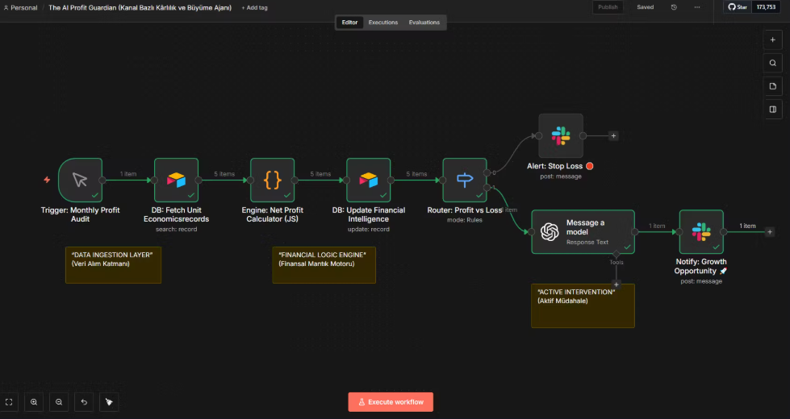

# 💰 The AI Profit Guardian (Omnichannel Unit Economics Agent)

> **"Revenue is Vanity, Profit is Sanity." An autonomous CFO that calculates real-time Net Profit per unit, kills loss-making products, and boosts high-margin winners.**

## 🚨 The Problem: The Revenue Trap
In Omnichannel E-commerce, looking at "Total Revenue" is a dangerous illusion.
* **Hidden Costs:** Marketplace commissions (20%+), shipping variances, and operational fees eat into margins silently.
* **The "Busy" Loss:** You might be selling thousands of units of a "Best Seller," but actually losing $2 on every shipment due to miscalculated Unit Economics.
* **Manual Blindness:** Tracking dynamic costs across multiple platforms via Excel is impossible in real-time.

## ✅ The Solution
This system acts as an **Autonomous Financial Manager (CFO)**.
It doesn't just look at sales; it calculates the exact **Net Profit** for every single SKU on every channel using a custom JavaScript Financial Engine.
* **Stop-Loss:** If a product is bleeding money, it alerts the team to kill the ad/listing immediately (Red Path).
* **Growth Engine:** If a product has a healthy margin (>15%), it triggers GPT-4o to write a growth marketing strategy (Green Path).

## 🛠 Tech Stack & Architecture

| Component | Role |
|-----------|------|
| **n8n** | Advanced logic routing and process orchestration. |
| **JavaScript (Code Node)** | The Financial Engine. Executes the math: `Net = Price - (COGS + Fees + Ship + Ads)`. |
| **Airtable (Unit Economics DB)** | Stores dynamic cost structures for every SKU. |
| **OpenAI (GPT-4o)** | **Growth Consultant:** Analyzes high-margin products to generate hooks & ad copy. |
| **Slack API** | Delivers "Stop-Loss" alerts and "Growth Opportunities" to the team. |

## ⚙️ Workflow Logic

1.  **Data Ingestion:** Fetches sales data and matches it with the Cost Structure from Airtable.
2.  **Financial Logic Engine (JS):** Calculates the *True Net Margin* down to the penny.
3.  **The Decision Router (Traffic Light System):**
    * 🔴 **Red Path (Loss):** Product is losing money. -> **Action:** Send "STOP-LOSS" Alert to Slack.
    * 🟡 **Yellow Path (Risk):** Margin < 15%. -> **Action:** Add to "Watchlist" for optimization.
    * 🟢 **Green Path (Growth):** Product is highly profitable. -> **Action:** Trigger AI Growth Consultant to generate scaling strategies.
4.  **Closed-Loop Reporting:** Writes the final financial health status back to the database.

## 🚀 How to Use

1.  Import `workflow.json` into n8n.
2.  Set up **Airtable** with `SKU`, `COGS` (Cost of Goods Sold), `Commission_Rate`, and `Shipping_Cost`.
3.  Configure the **JavaScript Node** if you have extra custom fees.
4.  Connect **OpenAI** and **Slack**.
5.  Stop celebrating revenue; start celebrating profit.
6.  

## 📞 Contact & Support

If you are interested in this project or would like to discuss custom **n8n automation solutions** for your business, feel free to reach out.

👉 **Visit my Website:** [emrahdemirkoc.com](https://emrahdemirkoc.com)  
📧 **Email:** [emrahdemirkoc@gmail.com](mailto:emrahdemirkoc@gmail.com)
